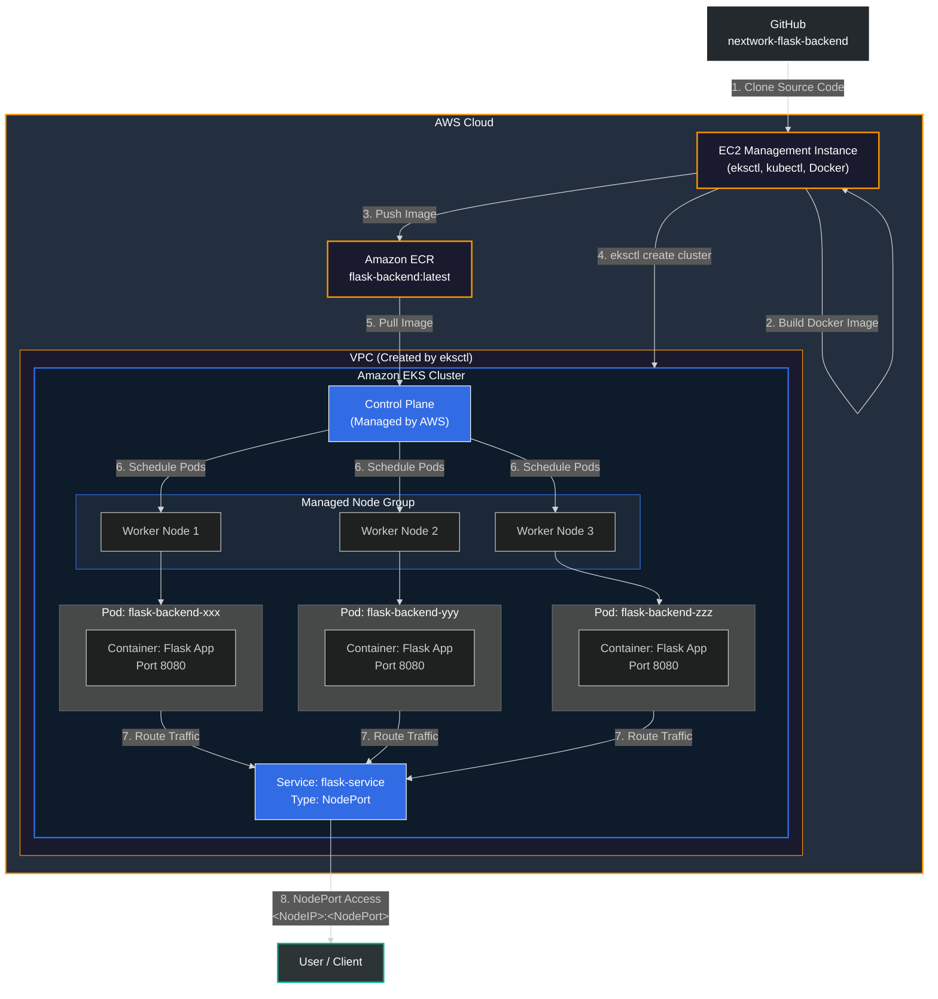

<h1 align="center">Deploy Backend with Kubernetes on Amazon EKS</h1>

<p align="center">
  
  
  
  
  
  
  
</p>

<p align="center">
  <b>A production-ready Kubernetes deployment of a Flask backend on Amazon EKS, featuring containerization, automated cluster provisioning, and declarative infrastructure management.</b>
</p>

<p align="center">
  
  
  
</p>

---

## Table of Contents

- [Overview](#overview)
- [Architecture](#architecture)
- [Prerequisites](#prerequisites)
- [Step-by-Step Deployment Guide](#step-by-step-deployment-guide)
  - [Step 1: Provision EC2 Instance](#step-1-provision-ec2-instance)
  - [Step 2: Install Required Tools](#step-2-install-required-tools)
  - [Step 3: Configure AWS Credentials](#step-3-configure-aws-credentials)
  - [Step 4: Clone the Backend Code](#step-4-clone-the-backend-code)
  - [Step 5: Build Docker Image](#step-5-build-docker-image)
  - [Step 6: Push to Amazon ECR](#step-6-push-to-amazon-ecr)
  - [Step 7: Create EKS Cluster](#step-7-create-eks-cluster)
  - [Step 8: Create Kubernetes Manifests](#step-8-create-kubernetes-manifests)
  - [Step 9: Deploy to EKS](#step-9-deploy-to-eks)
  - [Step 10: Verify and Test](#step-10-verify-and-test)
- [Kubernetes Manifests](#kubernetes-manifests)
- [Key Concepts Explained](#key-concepts-explained)
- [Troubleshooting](#troubleshooting)
- [What I Learned](#what-i-learned)
- [Cleanup](#cleanup)
- [Author](#author)
- [License](#license)

---

## Overview

This project demonstrates how to deploy a **Python Flask backend application** using **Kubernetes on Amazon EKS** in a production-ready manner. The entire workflow follows cloud-native best practices, including containerization, infrastructure as code, and declarative deployment patterns.

The project covers the complete deployment lifecycle:

1. **Provisioning** an EC2 instance as a management machine
2. **Containerizing** the Flask backend application with Docker
3. **Storing** the container image in Amazon ECR with versioned tags
4. **Orchestrating** the deployment on Amazon EKS using eksctl
5. **Managing** Kubernetes resources with kubectl and YAML manifests
6. **Exposing** the application via a NodePort Service for stable network access

By following this guide, you will gain hands-on experience with core cloud engineering tools and patterns used in real-world production environments.

---

## Architecture

The architecture follows a containerized, orchestrated deployment pattern on AWS. Below is the complete architectural flow:



### Architecture Components

| Component | Purpose |
|-----------|---------|
| **EC2 Management Instance** | Serves as the control machine for building images, running eksctl, and executing kubectl commands |
| **Docker** | Containerizes the Flask application into a portable, reproducible image |
| **Amazon ECR** | Private container registry for storing and versioning Docker images |
| **Amazon EKS** | Managed Kubernetes service that orchestrates container deployment |
| **eksctl** | CLI tool that simplifies EKS cluster creation via CloudFormation |
| **kubectl** | Kubernetes CLI for managing cluster resources and deployments |
| **CloudFormation** | AWS infrastructure as code service used by eksctl to provision VPC, subnets, IAM roles, and node groups |
| **NodePort Service** | Kubernetes Service type that exposes the application on a static port across all cluster nodes |

---

## Prerequisites

Before starting, ensure you have the following:

### AWS Requirements
- An **AWS account** with appropriate permissions
- **IAM user** with the following policies attached:
  - `AmazonEC2FullAccess`
  - `AmazonEKSClusterPolicy`
  - `AmazonEKSWorkerNodePolicy`
  - `AmazonEC2ContainerRegistryFullAccess`
  - `AmazonVPCFullAccess`
  - `CloudFormationFullAccess`
  - `IAMFullAccess`

### Local/Management Machine
- An **Amazon EC2 instance** (recommended: Amazon Linux 2 or Ubuntu, t2.medium or larger)
- **Security Group** allowing:
  - SSH (port 22) from your IP
  - Custom TCP (port 8080) for application access
  - Custom TCP (NodePort range 30000-32767) for Kubernetes Service access

### Tools to Install
The following tools will be installed on the EC2 management instance during the deployment process:

| Tool | Purpose | Installation Method |
|------|---------|-------------------|
| `eksctl` | EKS cluster management | Official binary download |
| `kubectl` | Kubernetes CLI | Official binary download |
| `AWS CLI` | AWS authentication and resource management | Package manager or pip |
| `Docker` | Container image building | System package manager |
| `Git` | Source code version control | System package manager |

---

## Step-by-Step Deployment Guide

### Step 1: Provision EC2 Instance

Launch an EC2 instance to serve as your management machine for the deployment process.

```bash
# Launch an Amazon Linux 2 instance (t2.medium recommended)
# Via AWS Console:
# 1. Navigate to EC2 Dashboard
# 2. Click "Launch Instance"
# 3. Choose "Amazon Linux 2 AMI"
# 4. Select t2.medium instance type (minimum for Docker and eksctl)
# 5. Configure Security Group with ports 22, 8080, and 30000-32767
# 6. Launch and connect via SSH

# Connect to your instance
ssh -i /path/to/your-key.pem ec2-user@<EC2_PUBLIC_IP>
```

**Recommended Security Group Rules:**

| Type | Protocol | Port Range | Source | Description |
|------|----------|------------|--------|-------------|
| SSH | TCP | 22 | Your IP/32 | SSH access |
| Custom TCP | TCP | 8080 | 0.0.0.0/0 | Flask app access |
| Custom TCP | TCP | 30000-32767 | 0.0.0.0/0 | Kubernetes NodePort range |

---

### Step 2: Install Required Tools

Install eksctl, kubectl, AWS CLI, Docker, and Git on the EC2 instance.

#### 2.1 Update System Packages
```bash
sudo yum update -y                    # Amazon Linux 2
# OR
sudo apt-get update && sudo apt-get upgrade -y   # Ubuntu
```

#### 2.2 Install eksctl
```bash
# Download and install eksctl
curl --silent --location "https://github.com/weaveworks/eksctl/releases/latest/download/eksctl_$(uname -s)_amd64.tar.gz" | tar xz -C /tmp
sudo mv /tmp/eksctl /usr/local/bin

# Verify installation
eksctl version
```

#### 2.3 Install kubectl
```bash
# Download the latest kubectl binary
curl -O https://s3.us-west-2.amazonaws.com/amazon-eks/1.28.3/2023-11-14/bin/linux/amd64/kubectl

# Apply execute permissions and move to PATH
chmod +x ./kubectl
mkdir -p $HOME/bin && cp ./kubectl $HOME/bin/kubectl && export PATH=$HOME/bin:$PATH

# Verify installation
kubectl version --client
```

#### 2.4 Install AWS CLI
```bash
# Install AWS CLI v2
curl "https://awscli.amazonaws.com/awscli-exe-linux-x86_64.zip" -o "awscliv2.zip"
unzip awscliv2.zip
sudo ./aws/install

# Verify installation
aws --version
```

#### 2.5 Install Docker
```bash
# Amazon Linux 2
sudo yum install docker -y
sudo service docker start
sudo usermod -a -G docker ec2-user

# Apply group changes (logout and login, or use newgrp)
newgrp docker

# Verify Docker installation
docker --version
```

#### 2.6 Install Git
```bash
sudo yum install git -y               # Amazon Linux 2
# OR
sudo apt-get install git -y           # Ubuntu

# Verify installation
git --version
```

---

### Step 3: Configure AWS Credentials

Configure AWS CLI with your IAM user credentials to enable authentication with AWS services.

```bash
# Configure AWS credentials
aws configure

# You will be prompted for:
# - AWS Access Key ID: [Your IAM Access Key]
# - AWS Secret Access Key: [Your IAM Secret Key]
# - Default region name: us-east-1  (or your preferred region)
# - Default output format: json
```

**Verify credentials are configured correctly:**
```bash
aws sts get-caller-identity
# Expected output: JSON with Account, UserId, and Arn
```

---

### Step 4: Clone the Backend Code

Clone the Flask backend application from the GitHub repository.

```bash
# Create a working directory
mkdir -p ~/projects && cd ~/projects

# Clone the backend repository
git clone https://github.com/nextwork-flask-backend.git

# Navigate into the project directory
cd nextwork-flask-backend

# Review the project structure
ls -la
```

**Expected project structure:**
```
nextwork-flask-backend/
|-- app.py                 # Main Flask application
|-- requirements.txt       # Python dependencies
|-- Dockerfile            # Docker image definition (if provided)
|-- README.md             # Project documentation
```

**Example `requirements.txt`:**
```
Flask==2.3.0
gunicorn==21.2.0
```

**Example `app.py`:**
```python
from flask import Flask, jsonify

app = Flask(__name__)

@app.route('/')
def home():
    return jsonify({
        "message": "Flask backend is running!",
        "status": "healthy"
    })

@app.route('/health')
def health():
    return jsonify({"status": "healthy"})

if __name__ == '__main__':
    app.run(host='0.0.0.0', port=8080)
```

---

### Step 5: Build Docker Image

Create a Docker image of the Flask application, including the Python interpreter, all dependencies, and runtime configuration.

```bash
# Navigate to the project directory
cd ~/projects/nextwork-flask-backend

# Create a Dockerfile if one doesn't exist
cat > Dockerfile << 'EOF'
FROM python:3.11-slim

# Set working directory
WORKDIR /app

# Copy requirements and install dependencies
COPY requirements.txt .
RUN pip install --no-cache-dir -r requirements.txt

# Copy application code
COPY . .

# Expose port 8080
EXPOSE 8080

# Run the Flask application with Gunicorn
CMD ["gunicorn", "--bind", "0.0.0.0:8080", "--workers", "4", "app:app"]
EOF

# Build the Docker image
docker build -t flask-backend:latest .

# Verify the image was created
docker images | grep flask-backend
```

**Docker image breakdown:**
- **Base image**: `python:3.11-slim` - lightweight Python runtime
- **Working directory**: `/app` - isolated application directory
- **Dependencies**: Installed from `requirements.txt` for consistent package versions
- **Application code**: Copied into the image for a self-contained runtime
- **Port exposure**: Port 8080 exposed for incoming traffic
- **Entry point**: Gunicorn WSGI server for production-grade request handling

---

### Step 6: Push to Amazon ECR

Push the Docker image to Amazon ECR so the EKS cluster can pull it during deployment.

```bash
# Step 6.1: Create an ECR repository (if it doesn't exist)
aws ecr create-repository \
    --repository-name flask-backend \
    --region us-east-1

# Step 6.2: Authenticate Docker with ECR
aws ecr get-login-password --region us-east-1 | \
    docker login --username AWS --password-stdin \
    <AWS_ACCOUNT_ID>.dkr.ecr.us-east-1.amazonaws.com

# Step 6.3: Tag the Docker image with ECR repository URI
docker tag flask-backend:latest \
    <AWS_ACCOUNT_ID>.dkr.ecr.us-east-1.amazonaws.com/flask-backend:latest

# Step 6.4: Push the image to ECR
docker push <AWS_ACCOUNT_ID>.dkr.ecr.us-east-1.amazonaws.com/flask-backend:latest

# Step 6.5: Verify the image is in ECR
aws ecr describe-images --repository-name flask-backend --region us-east-1
```

> **Note**: Replace `<AWS_ACCOUNT_ID>` with your actual 12-digit AWS account ID.

**The container image is now stored in ECR as a portable blueprint** - it contains everything needed to run the application consistently across any environment.

---

### Step 7: Create EKS Cluster

Use eksctl to provision a production-ready EKS cluster. Behind the scenes, eksctl uses CloudFormation to deploy the control plane, managed node groups, VPC, subnets, security groups, and IAM roles.

```bash
# Create the EKS cluster using eksctl
# This command deploys:
# - Control plane (managed by AWS)
# - Managed node group with EC2 worker nodes
# - VPC with public subnets
# - Security groups for cluster communication
# - IAM roles for worker node permissions

eksctl create cluster \
    --name flask-backend-cluster \
    --region us-east-1 \
    --node-type t3.medium \
    --nodes 3 \
    --nodes-min 2 \
    --nodes-max 5 \
    --managed \
    --asg-access \
    --external-dns-access \
    --full-ecr-access

# Parameters explained:
# --name: Cluster name
# --region: AWS region
# --node-type: EC2 instance type for worker nodes
# --nodes: Initial number of worker nodes (3)
# --nodes-min: Minimum nodes for auto-scaling (2)
# --nodes-max: Maximum nodes for auto-scaling (5)
# --managed: Use managed node groups
# --full-ecr-access: Grant worker nodes permission to pull images from ECR
```

**This process typically takes 15-20 minutes.** eksctl will:
1. Create a CloudFormation stack for the VPC and networking resources
2. Create a CloudFormation stack for the EKS control plane
3. Create a CloudFormation stack for the managed node group
4. Configure IAM roles with necessary permissions
5. Set up security groups for cluster communication

**Verify the cluster is ready:**
```bash
# Check cluster status
eksctl get cluster --name flask-backend-cluster --region us-east-1

# Verify worker nodes are registered
kubectl get nodes

# Expected output: 3 nodes in Ready state
# NAME                            STATUS   ROLES    AGE   VERSION
# ip-192-168-xx-xx.ec2.internal   Ready    <none>   5m    v1.28.x
# ip-192-168-xx-xx.ec2.internal   Ready    <none>   5m    v1.28.x
# ip-192-168-xx-xx.ec2.internal   Ready    <none>   5m    v1.28.x
```

---

### Step 8: Create Kubernetes Manifests

Create the Kubernetes YAML manifest files that declaratively define your deployment and service configuration.

#### 8.1 Create the Deployment Manifest

```bash
mkdir -p ~/projects/k8s-manifests && cd ~/projects/k8s-manifests
```

Create `flask-deployment.yaml`:

```yaml
apiVersion: apps/v1
kind: Deployment
metadata:
  name: flask-backend
  labels:
    app: flask-backend
spec:
  replicas: 3
  selector:
    matchLabels:
      app: flask-backend
  template:
    metadata:
      labels:
        app: flask-backend
    spec:
      containers:
        - name: flask-backend
          image: <AWS_ACCOUNT_ID>.dkr.ecr.us-east-1.amazonaws.com/flask-backend:latest
          ports:
            - containerPort: 8080
          resources:
            requests:
              memory: "128Mi"
              cpu: "100m"
            limits:
              memory: "256Mi"
              cpu: "200m"
          livenessProbe:
            httpGet:
              path: /health
              port: 8080
            initialDelaySeconds: 10
            periodSeconds: 10
          readinessProbe:
            httpGet:
              path: /health
              port: 8080
            initialDelaySeconds: 5
            periodSeconds: 5
```

#### 8.2 Create the Service Manifest

Create `flask-service.yaml`:

```yaml
apiVersion: v1
kind: Service
metadata:
  name: flask-service
  labels:
    app: flask-backend
spec:
  type: NodePort
  selector:
    app: flask-backend
  ports:
    - protocol: TCP
      port: 80
      targetPort: 8080
      nodePort: 30080
```

> **Important**: Replace `<AWS_ACCOUNT_ID>` with your actual AWS account ID in the Deployment manifest.

**Manifest components explained:**

| Field | Purpose |
|-------|---------|
| `replicas: 3` | Ensures 3 pod instances run at all times for high availability |
| `selector.matchLabels` | Links the Deployment to its pods via label matching |
| `image` | Points to the ECR repository for the container image |
| `containerPort: 8080` | Exposes port 8080 inside the container |
| `resources` | Defines CPU and memory requests/limits for resource scheduling |
| `livenessProbe` | Restarts the container if the health check fails |
| `readinessProbe` | Controls whether the pod receives traffic |
| `type: NodePort` | Exposes the service on a static port on each node |
| `nodePort: 30080` | The static port (30000-32767 range) accessible from outside the cluster |

---

### Step 9: Deploy to EKS

Apply the Kubernetes manifests to deploy the application to the EKS cluster.

#### 9.1 Ensure kubectl is configured for your cluster

If you encounter cluster access issues, update your kubeconfig:

```bash
# Update kubeconfig to connect to your EKS cluster
aws eks update-kubeconfig \
    --region us-east-1 \
    --name flask-backend-cluster

# Verify cluster connection
kubectl cluster-info
# Expected output: Kubernetes control plane is running at https://...
```

This command creates/updates the `~/.kube/config` file with the cluster endpoint and authentication credentials.

#### 9.2 Apply the manifests

```bash
# Apply the Deployment manifest
kubectl apply -f flask-deployment.yaml

# Apply the Service manifest
kubectl apply -f flask-service.yaml

# Expected output:
# deployment.apps/flask-backend created
# service/flask-service created
```

**What happens when you apply these manifests:**
1. The Kubernetes control plane receives the API requests from kubectl
2. The Deployment controller creates a ReplicaSet to manage 3 pod replicas
3. The scheduler assigns each pod to an available worker node
4. Each worker node's kubelet pulls the image from ECR and starts the container
5. The Service controller creates a NodePort endpoint for network access

---

### Step 10: Verify and Test

Confirm that all resources are running correctly and test the application endpoint.

#### 10.1 Check Deployment Status
```bash
# View the Deployment
kubectl get deployment flask-backend

# Expected output:
# NAME            READY   UP-TO-DATE   AVAILABLE   AGE
# flask-backend   3/3     3            3           2m
```

#### 10.2 Check Pod Status
```bash
# View all pods
kubectl get pods -o wide

# Expected output:
# NAME                             READY   STATUS    RESTARTS   AGE   NODE
# flask-backend-xxx-yyy            1/1     Running   0          2m    ip-192-168-xx-xx.ec2.internal
# flask-backend-xxx-zzz            1/1     Running   0          2m    ip-192-168-xx-xx.ec2.internal
# flask-backend-xxx-www            1/1     Running   0          2m    ip-192-168-xx-xx.ec2.internal
```

#### 10.3 Check Service Status
```bash
# View the Service
kubectl get service flask-service

# Expected output:
# NAME            TYPE       CLUSTER-IP      EXTERNAL-IP   PORT(S)        AGE
# flask-service   NodePort   10.100.x.x      <none>        80:30080/TCP   2m
```

#### 10.4 Describe Resources (for detailed information)
```bash
# Describe the Deployment
kubectl describe deployment flask-backend

# Describe the Pods
kubectl describe pods -l app=flask-backend

# Describe the Service
kubectl describe service flask-service
```

#### 10.5 View Pod Logs
```bash
# View logs from all pods
kubectl logs -l app=flask-backend

# View logs from a specific pod
kubectl logs flask-backend-xxx-yyy

# Follow logs in real-time
kubectl logs -f -l app=flask-backend
```

#### 10.6 Test the Application

```bash
# Get a worker node's IP address
NODE_IP=$(kubectl get nodes -o jsonpath='{.items[0].status.addresses[?(@.type=="ExternalIP")].address}')

# Test the application via NodePort
curl http://${NODE_IP}:30080/

# Expected response:
# {"message":"Flask backend is running!","status":"healthy"}

# Test the health endpoint
curl http://${NODE_IP}:30080/health

# Expected response:
# {"status":"healthy"}
```

---

## Kubernetes Manifests

### flask-deployment.yaml

```yaml
apiVersion: apps/v1
kind: Deployment
metadata:
  name: flask-backend
  labels:
    app: flask-backend
spec:
  replicas: 3
  selector:
    matchLabels:
      app: flask-backend
  template:
    metadata:
      labels:
        app: flask-backend
    spec:
      containers:
        - name: flask-backend
          image: <AWS_ACCOUNT_ID>.dkr.ecr.us-east-1.amazonaws.com/flask-backend:latest
          ports:
            - containerPort: 8080
          resources:
            requests:
              memory: "128Mi"
              cpu: "100m"
            limits:
              memory: "256Mi"
              cpu: "200m"
          livenessProbe:
            httpGet:
              path: /health
              port: 8080
            initialDelaySeconds: 10
            periodSeconds: 10
          readinessProbe:
            httpGet:
              path: /health
              port: 8080
            initialDelaySeconds: 5
            periodSeconds: 5
```

### flask-service.yaml

```yaml
apiVersion: v1
kind: Service
metadata:
  name: flask-service
  labels:
    app: flask-backend
spec:
  type: NodePort
  selector:
    app: flask-backend
  ports:
    - protocol: TCP
      port: 80
      targetPort: 8080
      nodePort: 30080
```

---

## Key Concepts Explained

### Containerization

Containerization packages an application with all its dependencies - including the runtime, libraries, and configuration - into a single, portable unit called a container image. This image serves as a **blueprint** that guarantees consistent behavior across development, staging, and production environments. By containerizing the Flask application, we eliminate the "it works on my machine" problem and ensure reproducibility.

### Container Orchestration

While containers are portable, managing them at scale requires orchestration. **Kubernetes** automates the deployment, scaling, and management of containerized applications. It handles scheduling pods across nodes, restarting failed containers, scaling replicas based on demand, and managing network connectivity - all without manual intervention.

### Declarative Infrastructure (YAML Manifests)

Kubernetes uses a **declarative model** where you define the desired state in YAML manifests, and the control plane works continuously to maintain that state. Instead of issuing imperative commands like "start three containers," you declare: "I want 3 replicas of this deployment running." If a pod fails, Kubernetes automatically creates a replacement to match the declared state.

### NodePort Service

Pods in Kubernetes are ephemeral - they can be created, destroyed, and rescheduled dynamically. This means their IP addresses change constantly. A **NodePort Service** solves this by providing a stable network endpoint. It:
- Exposes the service on a static port (30080 in this project) on every worker node
- Load-balances incoming traffic across all matching pods
- Maintains a consistent access point regardless of pod lifecycle changes

### IAM Integration for ECR Access

The EKS worker nodes need permission to pull container images from ECR. Instead of embedding credentials in manifests, **IAM roles for service accounts (IRSA)** or **node IAM policies** grant these permissions automatically. In this project, eksctl configured the worker node IAM role with `AmazonEC2ContainerRegistryReadOnly` policy, allowing nodes to pull images without manual credential management.

### Kubernetes Control Plane

The control plane is the brain of the Kubernetes cluster. It:
- Maintains the cluster's desired state
- Schedules pods to appropriate worker nodes
- Monitors pod health and restarts failed containers
- Handles scaling operations
- Manages Service discovery and networking

---

## Troubleshooting

### kubectl Cannot Connect to Cluster

**Symptom**: `kubectl get nodes` returns "Unable to connect to the server" or "Unauthorized"

**Solution**:
```bash
# Update kubeconfig with the correct cluster credentials
aws eks update-kubeconfig --region us-east-1 --name flask-backend-cluster

# Verify AWS credentials are valid
aws sts get-caller-identity

# Check kubeconfig file exists and is valid
cat ~/.kube/config
```

### Pods Stuck in "Pending" State

**Symptom**: `kubectl get pods` shows pods in "Pending" status

**Causes & Solutions**:
| Cause | Diagnosis | Solution |
|-------|-----------|----------|
| Insufficient resources | `kubectl describe pod <pod-name>` | Increase node instance type or add more nodes |
| Image pull failure | Check `kubectl describe pod` Events | Verify ECR URI and ensure IAM permissions for ECR access |
| Node not ready | `kubectl get nodes` | Wait for node group provisioning to complete |

```bash
# Check detailed pod status and events
kubectl describe pod <pod-name>

# Check for image pull errors
kubectl get events --sort-by='.lastTimestamp'
```

### Image Pull Errors (ErrImagePull / ImagePullBackOff)

**Symptom**: Pods show `ErrImagePull` or `ImagePullBackOff` status

**Solution**:
```bash
# Verify the image exists in ECR
aws ecr describe-images --repository-name flask-backend

# Check the image URI in the Deployment manifest matches ECR
kubectl get deployment flask-backend -o yaml | grep image

# Verify worker nodes have ECR access via IAM
aws iam list-attached-role-policies --role-name <node-role-name>

# Ensure the ECR repository is in the same region as the cluster
```

### Pods in "CrashLoopBackOff"

**Symptom**: Pods repeatedly crash and restart

**Solution**:
```bash
# Check pod logs for application errors
kubectl logs <pod-name>

# Verify the container port matches the Service targetPort
# Check that the Flask app is binding to 0.0.0.0 (not localhost)
# Verify required environment variables are set
```

### Service Not Accessible via NodePort

**Symptom**: Cannot reach the application via `<NodeIP>:30080`

**Solution**:
```bash
# Verify the Service exists and has endpoints
kubectl get service flask-service
kubectl get endpoints flask-service

# Check security group rules allow NodePort range (30000-32767)
# Ensure the NodePort (30080) matches your curl request
# Verify pods are passing health checks
kubectl get pods -l app=flask-backend

# Test connectivity from inside the cluster
kubectl run test --image=curlimages/curl --rm -it -- \
    curl http://flask-service:80/
```

---

## What I Learned

*By Lindokuhle Sithole — Cloud Engineer | Cloud DevOps Engineer | Cloud Security Specialist*

This project was a comprehensive hands-on experience that deepened my understanding of cloud-native deployment patterns. Here are the key takeaways:

### Containerization as a Foundation
Building a Docker image taught me that containers are more than just packaging - they are **portable blueprints** that encapsulate the entire application runtime. The consistency across environments eliminates deployment surprises.

### The Power of Declarative Infrastructure
Writing YAML manifests and applying them with `kubectl apply` demonstrated the elegance of declarative configuration. Instead of manually provisioning resources, I declared the desired state and let Kubernetes maintain it automatically.

### Kubernetes Networking with Services
Understanding why we use a **NodePort Service** instead of directly accessing pods was a key insight. Pods are transient, but Services provide a stable network abstraction. This pattern is fundamental to production Kubernetes deployments.

### IAM and Security Integration
Configuring ECR access through IAM roles instead of embedding credentials reinforced the principle of **least privilege** and secure-by-default design. The integration between AWS IAM and EKS is seamless when properly configured.

### The eksctl Abstraction
Using eksctl showed me how powerful abstractions simplify complex operations. Behind a single command, CloudFormation was orchestrating VPC creation, subnet provisioning, security group configuration, IAM role setup, and control plane deployment.

### Debugging and Persistence
Troubleshooting the kubectl cluster connection with `aws eks update-kubeconfig` taught me that cloud deployments require patience and systematic debugging. Understanding the `~/.kube/config` file structure helped me appreciate how Kubernetes manages authentication.

### Production Readiness
Adding health checks (liveness and readiness probes), resource limits, and multiple replicas transformed this from a simple deployment into a **production-ready** configuration that can handle failures gracefully.

---

## Cleanup

To avoid ongoing AWS charges, tear down all resources when you're done:

### Step 1: Delete Kubernetes Resources
```bash
# Delete the Service
kubectl delete -f flask-service.yaml

# Delete the Deployment
kubectl delete -f flask-deployment.yaml

# Verify all resources are removed
kubectl get all
```

### Step 2: Delete the EKS Cluster
```bash
# Delete the entire EKS cluster (this also deletes CloudFormation stacks)
eksctl delete cluster --name flask-backend-cluster --region us-east-1

# This command deletes:
# - EKS control plane
# - Managed node groups and worker nodes
# - CloudFormation stacks (VPC, subnets, security groups, IAM roles)
```

### Step 3: Delete the ECR Repository
```bash
# Delete the ECR repository and all images
aws ecr delete-repository \
    --repository-name flask-backend \
    --force \
    --region us-east-1
```

### Step 4: Terminate the EC2 Instance
```bash
# Via AWS Console or CLI:
aws ec2 terminate-instances --instance-ids <INSTANCE_ID> --region us-east-1
```

### Cleanup Verification Checklist

- [ ] Kubernetes Deployment deleted
- [ ] Kubernetes Service deleted
- [ ] EKS cluster deleted (verify in EKS console)
- [ ] CloudFormation stacks deleted
- [ ] ECR repository deleted
- [ ] EC2 instance terminated

> **Warning**: Failing to clean up resources will result in ongoing AWS charges. The EKS control plane costs approximately $0.10 per hour, and EC2 worker nodes incur compute charges.

---

## Author

**Lindokuhle Sithole** — *Cloud Engineer | Cloud DevOps Engineer | Cloud Security Specialist*

📍 **Location:** Bremen, Germany  
💼 **LinkedIn:** [linkedin.com/in/lindokuhle-sithole-bb701b19a](https://www.linkedin.com/in/lindokuhle-sithole-bb701b19a)  
🐙 **GitHub:** [github.com/lindokuhlesithole](https://github.com/lindokuhlesithole)  
📧 **Email:** [sitholelindokuhle371@gmail.com](mailto:sitholelindokuhle371@gmail.com)

### Certifications

<p>
  
  
  
  
  
</p>

| Certification | Level | Issuer |
|---|---|---|
| AWS Certified Solutions Architect – Professional | Professional | Amazon Web Services |
| AWS Certified Cloud Practitioner | Foundational | Amazon Web Services |
| AWS Certified CloudOps Engineer – Associate | Associate | Amazon Web Services |
| AWS Certified Security – Specialty | Specialty | Amazon Web Services |
| Pre Security Certificate | Foundational | CompTIA Security+ |

### Education

🎓 **University of the Witwatersrand** — Bachelor of Science (BS), Mathematical Science

---

## License

This project is licensed under the MIT License.

```
MIT License

Copyright (c) 2024 Lindokuhle Sithole

Permission is hereby granted, free of charge, to any person obtaining a copy
of this software and associated documentation files (the "Software"), to deal
in the Software without restriction, including without limitation the rights
to use, copy, modify, merge, publish, distribute, sublicense, and/or sell
copies of the Software, and to permit persons to whom the Software is
furnished to do so, subject to the following conditions:

The above copyright notice and this permission notice shall be included in all
copies or substantial portions of the Software.

THE SOFTWARE IS PROVIDED "AS IS", WITHOUT WARRANTY OF ANY KIND, EXPRESS OR
IMPLIED, INCLUDING BUT NOT LIMITED TO THE WARRANTIES OF MERCHANTABILITY,
FITNESS FOR A PARTICULAR PURPOSE AND NONINFRINGEMENT. IN NO EVENT SHALL THE
AUTHORS OR COPYRIGHT HOLDERS BE LIABLE FOR ANY CLAIM, DAMAGES OR OTHER
LIABILITY, WHETHER IN AN ACTION OF CONTRACT, TORT OR OTHERWISE, ARISING FROM,
OUT OF OR IN CONNECTION WITH THE SOFTWARE OR THE USE OR OTHER DEALINGS IN THE
SOFTWARE.
```

---

<p align="center">
  <b>Built with cloud-native best practices by <a href="https://www.linkedin.com/in/lindokuhle-sithole-bb701b19a">Lindokuhle Sithole</a> — Cloud Engineer | Cloud DevOps Engineer | Cloud Security Specialist</b>
</p>

<p align="center">
  
  
  
</p>
